# Sensor Fusion Self-Driving Car Course


### Project 
We first create a simulator of the Lidar throwing beams in the space, for future processing. 
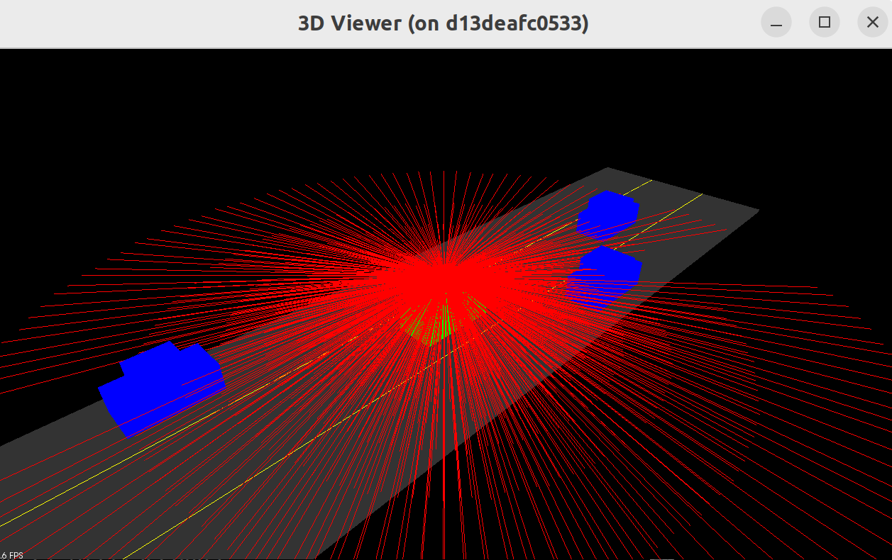

Then, we modify the simulator to only render the point cloud data based on the rays that were previously created.
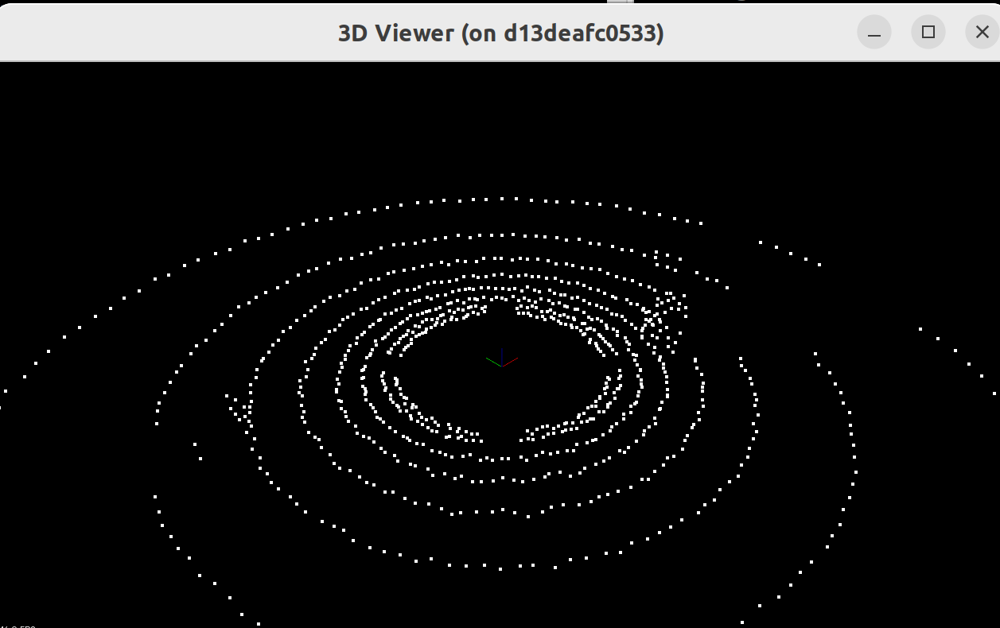

Then, we used segmentation methods using RANSAC algorihtm and extraction methods to separate the plane and the objects detected from the point cloud. AFter that, the results of the different objects detected around the lidar are shown in the simulator.

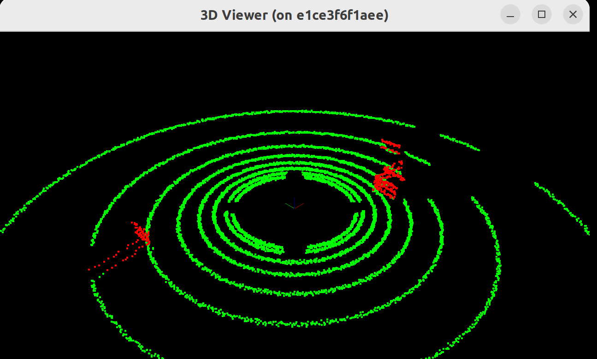

Next, we implemented euclidan clustr exraction from PCL to obtain the different clusters of the PCD. Also, we dislayed each different cluster as shown in image belwo about different objects around lidar in simulator.

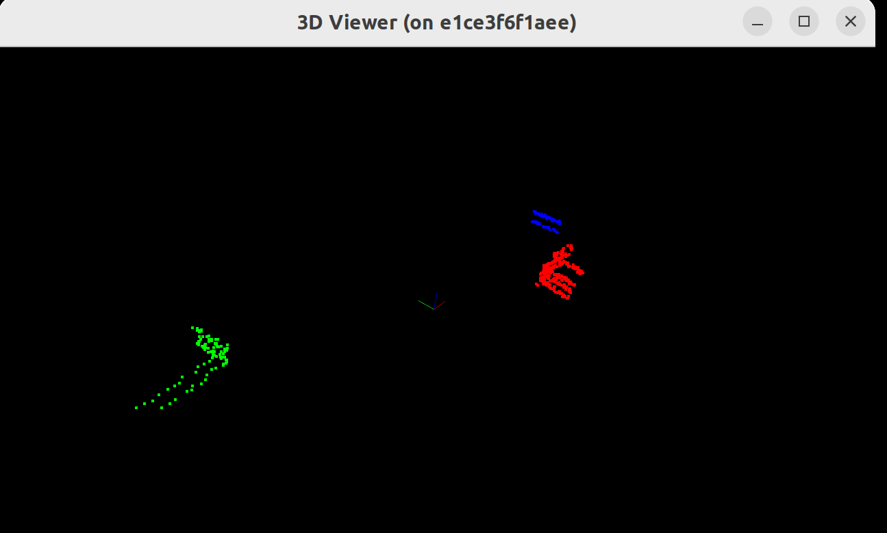

And now displaying also the plane/road that was segmented at first using plane model segmentation usig RANSAC, we obtain our objects and plane in the next shape:

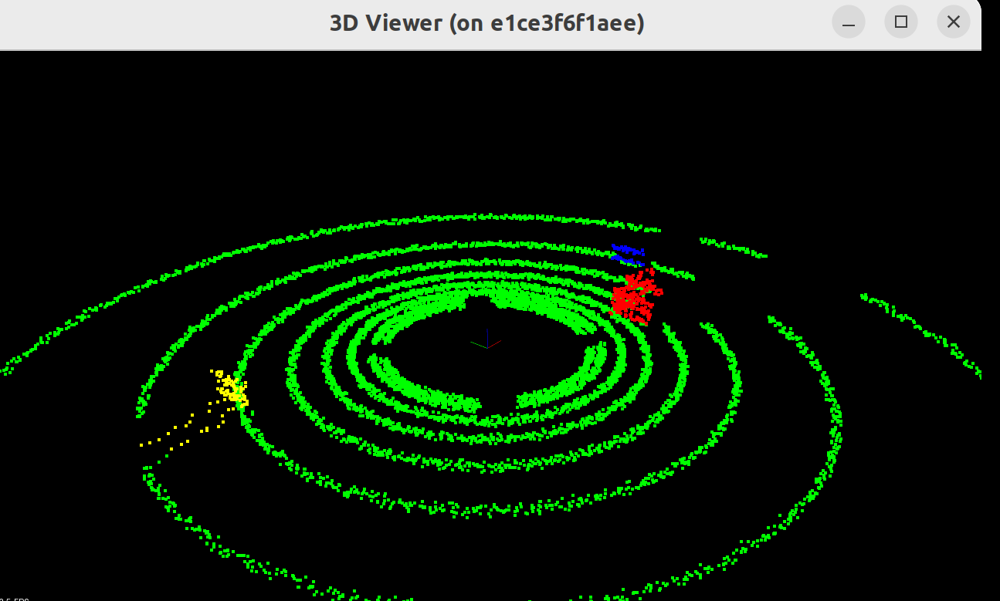

After that, I implemented my own Kd tree algorithm for insertion and searching. And use that implmementation and constructed my own euclidan clustering algorithm to separate between datapoints. This is a result with 2D data.

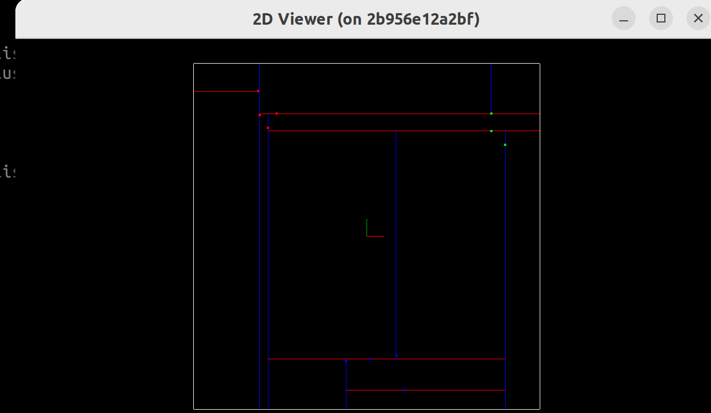

For the last part, I implemented boudning boxes around the objects that exists in the plane. 

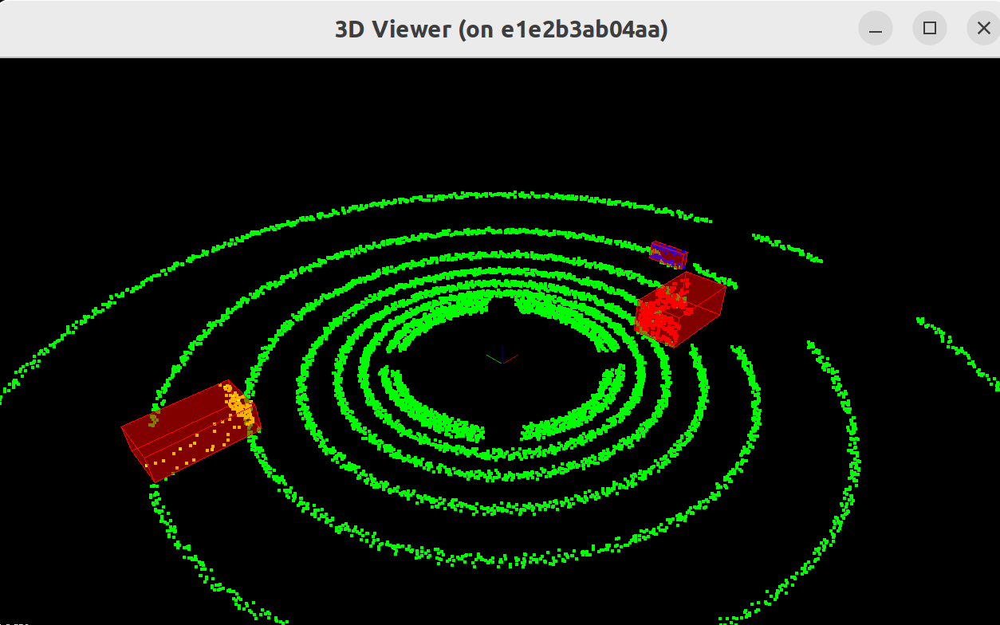

After all of this, we now render real PCD data to work and apply the functions that were previously created. An initial view of the PCD can be seen below of a city block.

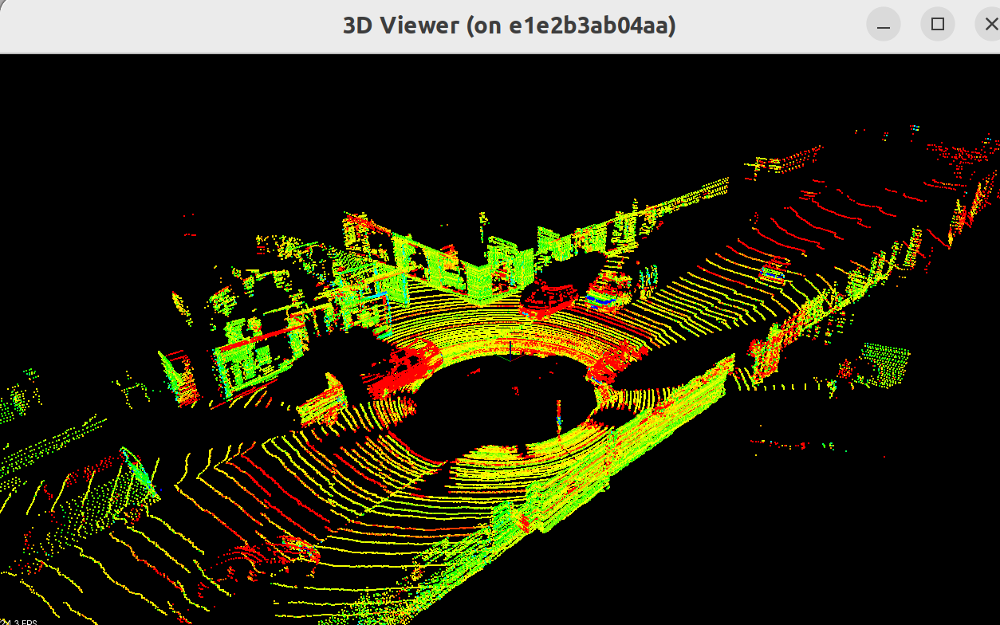

For extra cleaning and easier processing, we also created a function to remove the points that the lidar was reading from the roof of the car. We also applied vox grid filtering to dowsample the points of our PCD for easier calculations and selected a region of interest to only focus on the impornat parts of the point cloud. After all this, we also used function to filter and extract the point cloud information of the roof. 

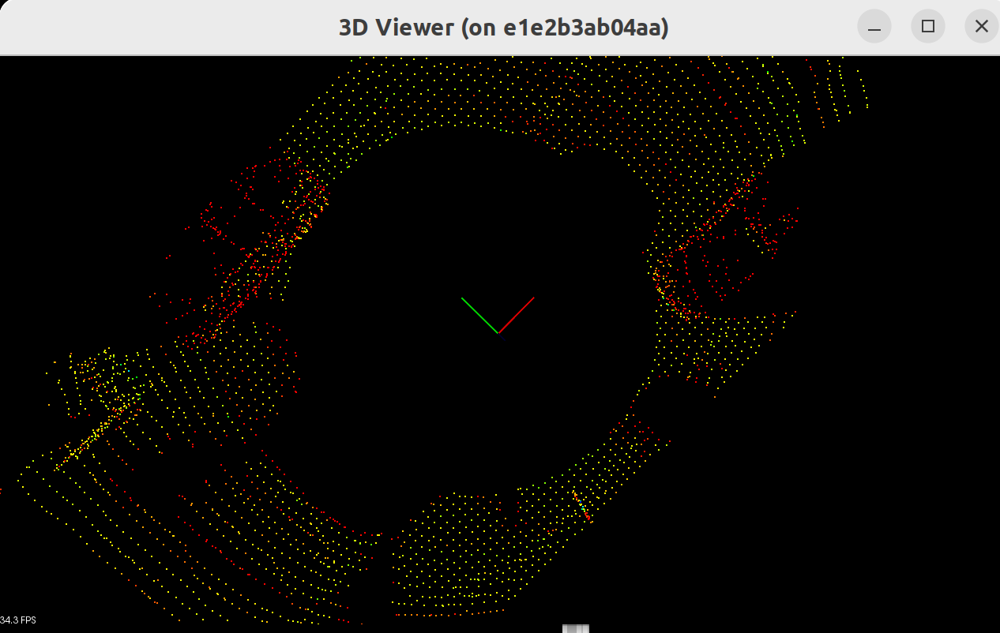

The next steps where preparing image for obstacle detections: 

1. Segment the filter cloud in two parts, the road and the obstacles. We used the previous segmentined algorhtms to segement the objects from the road. Furtheremo, we display the roof of the car in a box to show the region of the roof of the car that was removed from clusters. 

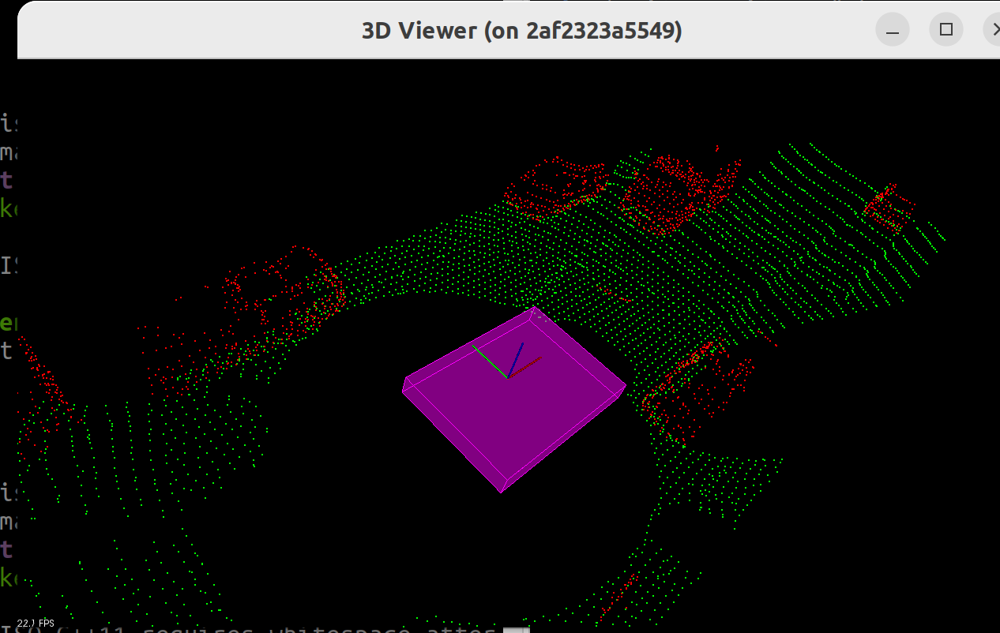

2. Step 2 of obstacle detection is clustiner the obstacle cloud. We cluster the objects based on the proximity of the neighbors using the previous fucniton created using euclidean clustering optimized by kd tree. Diferent thresholds and min/max values were used to find and fit the best separation between objects. 

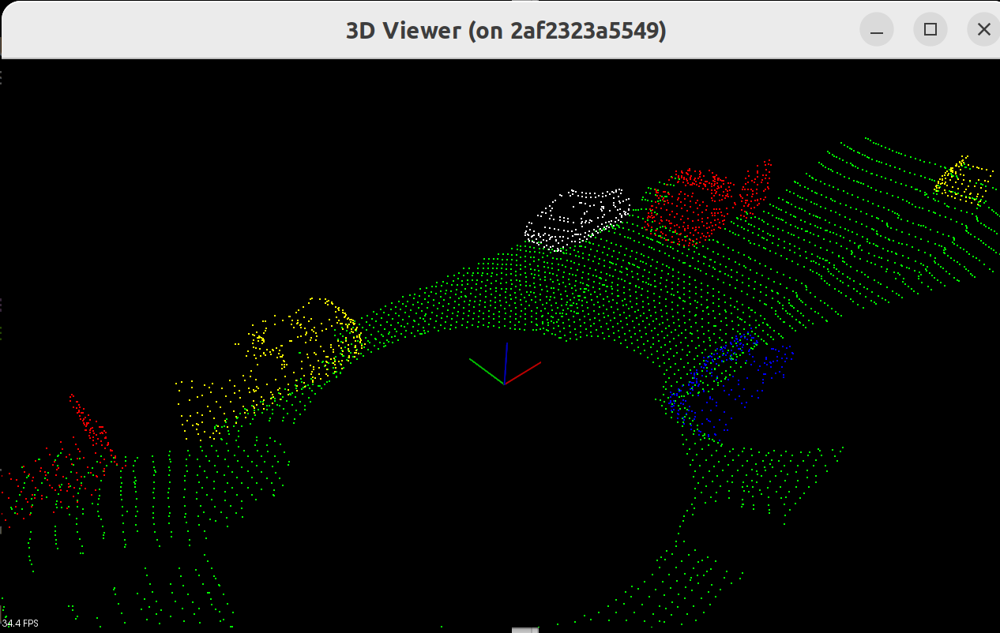

3. Step 3 was applying bounding boxes around individual clusters. 

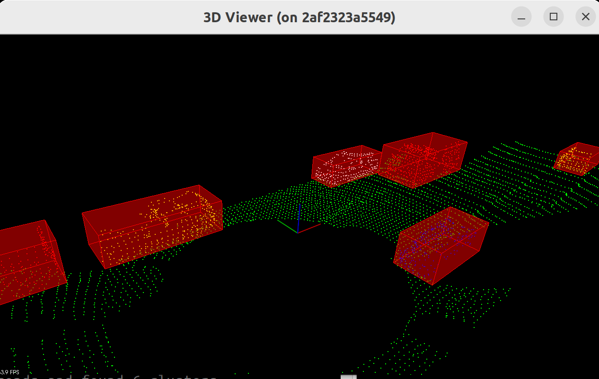

4. The final step we created a stream of multiple pcd data to streamline it as a streaming video and apply in each frame the detection algorithm for multiple objects.


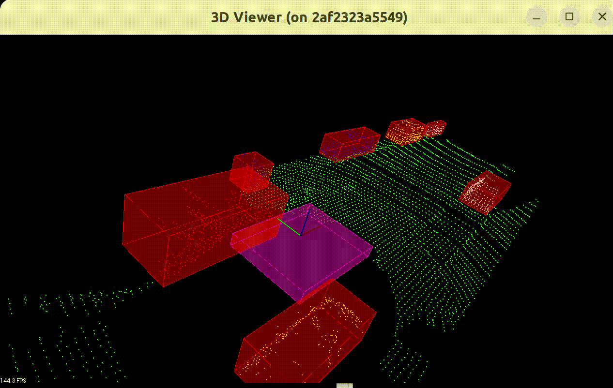

5. After all the previous steps, I implemented a final functionality using a different pcd files to track a cyclist through consecutive frames. For this tracking, I utilized PCL's Particle Filter Algorithm The red dots visible in the visualization represent the particles showing potential positions, while the blue points show the transformed reference model at the estimated position. Below can be seen the result of the cyclist being tracked through the sequence.


### Sensor Fusion course for self-driving cars.

This course is about sensor fusion, which is the process of taking data from multiple sensors and combining it to give us a better understanding of the world around us. The focus is on two sensors, lidar, and radar.

**Lidar** sensing gives us high resolution data by sending out thousands of laser signals. These lasers bounce off objects, returning to the sensor where we can then determine how far away objects are by timing how long it takes for the signal to return. Also we can tell a little bit about the object that was hit by measuring the intesity of the returned signal. Each laser ray is in the infrared spectrum, and is sent out at many different angles, usually in a 360 degree range. While lidar sensors gives us very high accurate models for the world around us in 3D, they are currently very expensive, upwards of $60,000 for a standard unit.

**Radar** data is typically very sparse and in a limited range, however it can directly tell us how fast an object is moving in a certain direction. This ability makes radars a very pratical sensor for doing things like cruise control where its important to know how fast the car infront of you is traveling. Radar sensors are also very affordable and common now of days in newer cars.

**Sensor Fusion** by combing lidar's high resolution imaging with radar's ability to measure velocity of objects we can get a better understanding of the sorrounding environment than we could using one of the sensors alone.

## Workspace

The workspace provided in the SFND classroom comes preinstallated with everything that you need to finish the exercises and projects. Versions used by Udacity for this ND are as follows:

* Ubuntu 16.04
* PCL - v1.7.2
* C++ v11
* gcc v5.5

**Note** The [[CMakeLists.txt](https://github.com/udacity/SFND_Lidar_Obstacle_Detection/blob/master/CMakeLists.txt)] file provided in this repo can be used locally if you have the same package versions as mentioned above. If you want to run this project locally (outside the Udacity workspace), please follow the steps under the **Local Installation** section.


## Local Installation

### Ubuntu 

1. Clone this github repo:

   ```sh
   cd ~
   git clone https://github.com/udacity/SFND_Lidar_Obstacle_Detection.git
   ```

2.  Edit [CMakeLists.txt](https://github.com/udacity/SFND_Lidar_Obstacle_Detection/blob/master/CMakeLists.txt) as follows:

   ```cmake
   cmake_minimum_required(VERSION 2.8 FATAL_ERROR)
   
   add_definitions(-std=c++14)
   
   set(CXX_FLAGS "-Wall")
   set(CMAKE_CXX_FLAGS, "${CXX_FLAGS}")
   
   project(playback)
   
   find_package(PCL 1.11 REQUIRED)
   
   include_directories(${PCL_INCLUDE_DIRS})
   link_directories(${PCL_LIBRARY_DIRS})
   add_definitions(${PCL_DEFINITIONS})
   list(REMOVE_ITEM PCL_LIBRARIES "vtkproj4")
   
   
   add_executable (environment src/environment.cpp src/render/render.cpp src/processPointClouds.cpp)
   target_link_libraries (environment ${PCL_LIBRARIES})
   ```

3. Execute the following commands in a terminal

   ```shell
   sudo apt install libpcl-dev
   cd ~/SFND_Lidar_Obstacle_Detection
   mkdir build && cd build
   cmake ..
   make
   ./environment
   ```

   This should install the latest version of PCL. You should be able to do all the classroom exercises and project with this setup.
   
**Note** The library version of PCL being distributed by the apt repository for 18.04 and 20.04 are both older than v1.11. The following links have the information regarding the versions-

[Bionic 18.04](https://www.ubuntuupdates.org/package/core/bionic/universe/updates/libpcl-dev)
[Focal 20.04](https://www.ubuntuupdates.org/package/core/focal/universe/base/libpcl-dev)

You can either build PCL from source (for v1.11) or use the older version.

### MAC

#### Install via Homebrew
1. install [homebrew](https://brew.sh/)
2. update homebrew 
	```bash
	$> brew update
	```
3. add  homebrew science [tap](https://docs.brew.sh/Taps) 
	```bash
	$> brew tap brewsci/science
	```
4. view pcl install options
	```bash
	$> brew options pcl
	```
5. install PCL 
	```bash
	$> brew install pcl
	```

6. Clone this github repo

   ```shell
   cd ~
   git clone https://github.com/udacity/SFND_Lidar_Obstacle_Detection.git
   ```

7. Edit the CMakeLists.txt file as shown in Step 2 of Ubuntu installation instructions above.

8. Execute the following commands in a terminal

   ```shell
   cd ~/SFND_Lidar_Obstacle_Detection
   mkdir build && cd build
   cmake ..
   make
   ./environment
   ```
If you get build errors related to Qt5, make sure that the path for Qt5 is correctly set in .bash_profile or .zsh_profile (Refer [#45](https://github.com/udacity/SFND_Lidar_Obstacle_Detection/issues/45))

### WINDOWS

#### Install via cvpkg

1. Follow the steps [here](https://pointclouds.org/downloads/) to install PCL.

2. Clone this github repo

   ```shell
   cd ~
   git clone https://github.com/udacity/SFND_Lidar_Obstacle_Detection.git
   ```

3. Edit the CMakeLists.txt file as shown in Step 2 of Ubuntu installation instructions above.

4. Execute the following commands in Powershell or Terminal

   ```shell
   cd ~/SFND_Lidar_Obstacle_Detection
   mkdir build && cd build
   cmake ..
   make
   ./environment
   ```

#### Build from Source

[PCL Source Github](https://github.com/PointCloudLibrary/pcl)

[PCL Mac Compilation Docs](https://pcl.readthedocs.io/projects/tutorials/en/latest/compiling_pcl_macosx.html#compiling-pcl-macosx)
